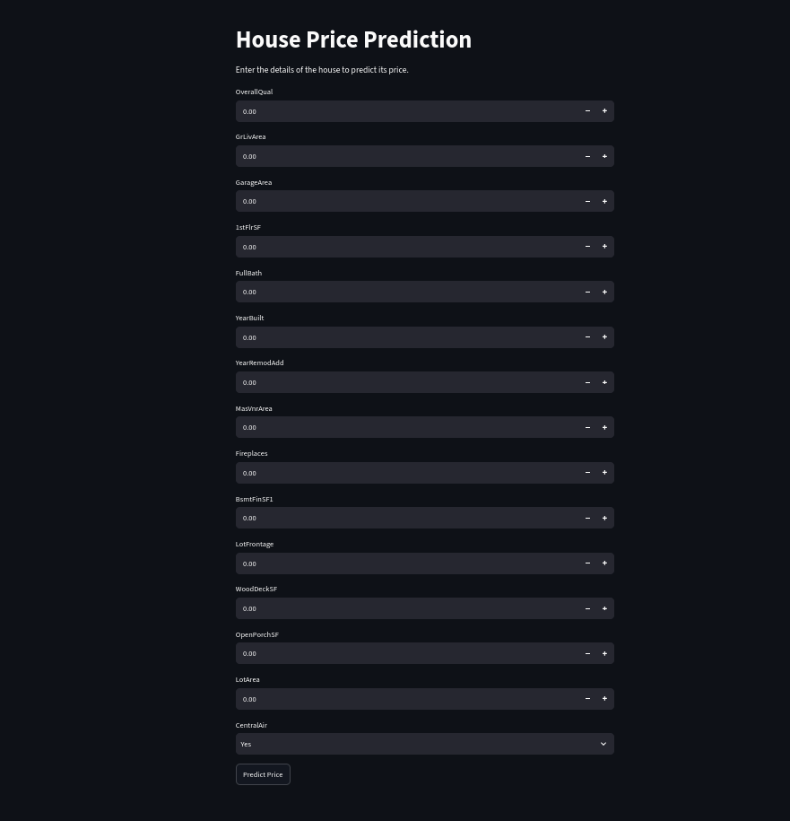
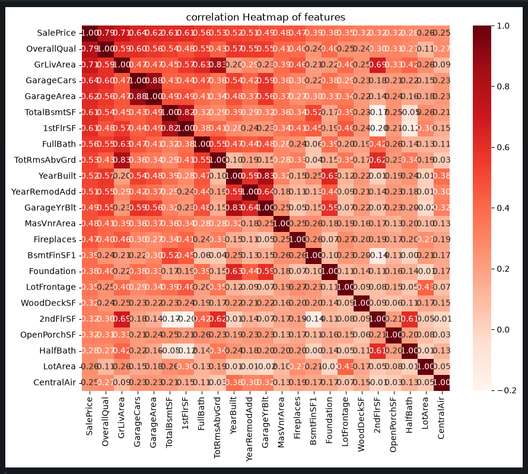
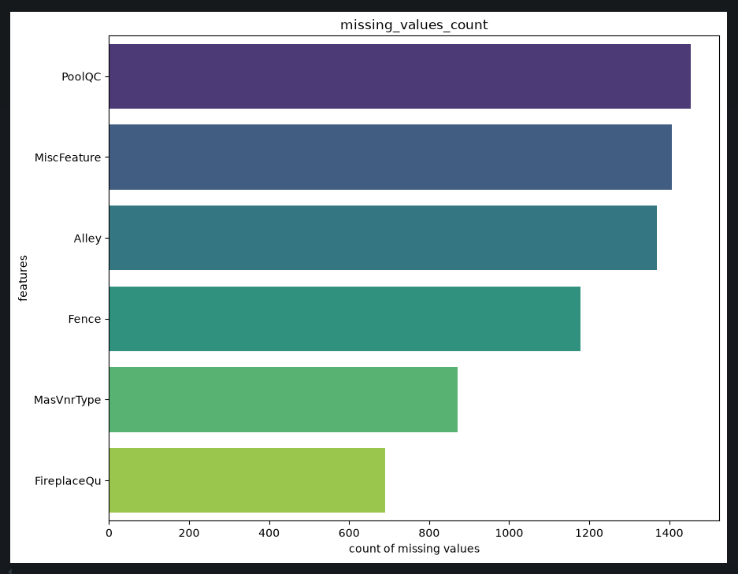

# 🏠 House Price Prediction


Ever wondered what your house is *actually* worth — or just wanted to mess around with a machine learning model that thinks it knows? This app takes a bunch of details about a house (size, quality, garage space, how old it is, etc.) and spits out a price prediction, no crystal ball required.

**🔗 Web app:** [house-price-prediction9.streamlit.app](https://house-price-prediction9.streamlit.app/)
**🔗 Live API:** [house-price-prediction-production-8533.up.railway.app/docs](https://house-price-prediction-production-8533.up.railway.app/docs)

<p align="center">
  
</p>

---

## What it does

Feed it the basics about a house — square footage, overall quality rating, garage size, year built, and a handful of other features — and a regression model trained on real housing data guesses at the sale price.

You can poke at it two ways:
- **The web app** — a simple form, fill it out, hit predict, watch the number appear.
- **The API** — send it a `POST /predict` with JSON, get a price back. Good for hooking it into other projects.

## Built with

| What | Why |
|---|---|
| scikit-learn + pandas | trains and crunches the numbers (`notebook.ipynb`) |
| FastAPI | serves predictions over a clean REST endpoint |
| Streamlit | the friendly UI you actually click around in |
| joblib | saves/loads the trained model |
| Docker | so it runs the same everywhere, no "works on my machine" |

## Behind the scenes: exploring the data

Before training anything, I dug into the dataset to see what actually drives price and what needed cleaning up.

**Which features matter most?** A correlation heatmap made it obvious that overall quality, living area, and garage size track closely with sale price:

<p align="center">
  
</p>

**What needed cleaning?** A handful of columns had a lot of missing values (pool quality, alley access, fence type) — nice-to-have context but not something every house has, so this shaped how they were handled going into training:

<p align="center">
  
</p>

The full walkthrough — cleaning, feature selection, model training, evaluation — is in `notebook.ipynb`.

## What's in here

```
├── notebook.ipynb          # where the model actually gets trained (EDA included)
├── app.py                  # the Streamlit app
├── api.py                  # the FastAPI endpoint
├── house_price_model.jb    # the trained model, saved and ready to go
├── dataset.csv             # the data it learned from
├── app-screenshot.png      # screenshot used in this README
├── correlation-heatmap.png # screenshot used in this README
├── missing-values.png      # screenshot used in this README
├── Dockerfile
└── requirements.txt
```

## Running it yourself

```bash
git clone https://github.com/kunalsharmadev/House-Price-Prediction.git
cd House-Price-Prediction
pip install -r requirements.txt
```

**Want the web app?**
```bash
streamlit run app.py
```

**Want the API instead?**
```bash
uvicorn api:app --reload
```

**Prefer Docker?**
```bash
docker build -t house-price-predictor .
docker run -p 8000:8000 house-price-predictor
```

## Poking the API directly

```bash
curl -X POST "https://house-price-prediction-production-8533.up.railway.app/predict" \
  -H "Content-Type: application/json" \
  -d '{
    "OverallQual": 7,
    "GrLivArea": 1710,
    "GarageCars": 2,
    "FirstFlrSF": 856,
    "TotBath": 2,
    "YearBuilt": 2003,
    "YearRemodAdd": 2003,
    "MasVnrArea": 196,
    "Fireplaces": 0,
    "BsmtFinSF1": 706,
    "LotFrontage": 65,
    "WoodDeckSF": 0,
    "OpenPorchSF": 61,
    "LotArea": 8450,
    "CentralAir": "Y"
  }'
```

> You'll get back: `{"predicted_price": <value>}`

Or skip curl entirely and test it straight from your browser at the [interactive docs](https://house-price-prediction-production-8533.up.railway.app/docs).

## About the model

Trained in `notebook.ipynb` on 15 property features — quality, living area, garage capacity, basement finish, lot size, and more. Crack open the notebook if you want to see the full data exploration and how it landed on this set of features.

## What's next

- [ ] Get the API and the Streamlit app fully in sync on feature names/units
- [ ] Add sane input validation so it doesn't choke on weird values
- [ ] Publish real evaluation metrics (RMSE, R²) here instead of leaving you guessing
- [ ] A few automated tests, because hope is not a strategy
- [ ] Wire up CI so every push gets checked automatically

## License

MIT — see [LICENSE](LICENSE). Do what you want with it.

## Author

Made by [Kunal Sharma](https://github.com/kunalsharmadev)
